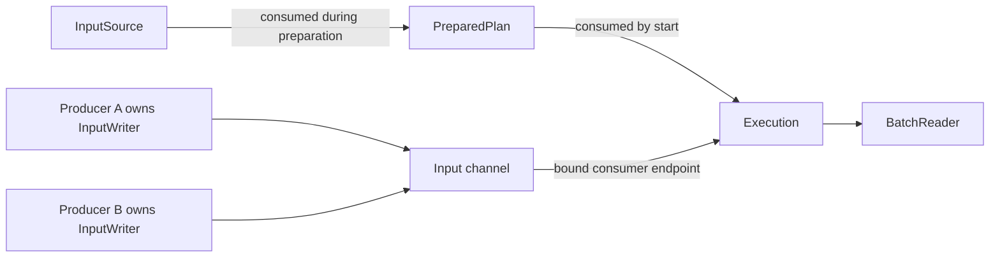

# Public query execution API proposal

**Status:** draft for discussion. Types and examples below describe a proposed API,
not implemented contracts or finalized signatures.

## Scope

Introduce an API for externally supplied plans, initially Substrait, through the C ABI
with C++ and Rust wrappers. Prefer immutable descriptions and distinct types for
preparation, execution, and streaming capabilities.

Start with materialized execution, then add live streaming, backpressure, and
cancellation. Keep existing integrations working during migration. SQL preparation,
reusable prepared templates, and multiple independent contexts are follow-ups. The
initial implementation retains the one-active-context-per-process restriction.

## Why C underneath C++ and Rust?

The C ABI provides one implementation boundary for all consumers:

- Keep C++ standard-library types, exceptions, and compiler-specific object layouts
  out of the binary interface.
- Let C++ provide RAII and `std::expected`, and Rust provide ownership, `Result`, and
  audited `Send`/`Sync` contracts.
- Keep execution semantics and error handling consistent across languages.
- Allow implementation components to move between C++ and Rust without changing
  the consumer-facing boundary.

Binary packaging and runtime dependency compatibility remain separate concerns.

## Public model

| Type | Responsibility |
|---|---|
| `Context` | Engine resources and scheduling services. |
| `Session` | Planning environment, including catalog and settings, when needed. |
| `Plan` | Immutable, parsed plan description. |
| `PreparedPlan` | Plan bound to inputs, schemas, resources, and output routing. |
| `Execution` | Control and observe one submitted execution. |
| `InputSource` | An owning consumer endpoint, bound into a prepared plan. |
| `InputWriter` | Feed batches through one producer capability. |
| `BatchReader` | Consume one output stream. |
| `Schema` / `RecordBatch` | Owned typed data with Arrow interoperability. |
| `CancellationHandle` | Request cancellation independently of execution ownership. |
| `ExecutionReport` | Immutable terminal execution information and statistics. |

```text
Serialized plan → Plan → PreparedPlan → Execution → Terminal outcome
                         ↑                 ↕
                    Input bindings    Writers / readers
                    Output routing
```

Parsing produces an owned, structurally valid `Plan`. Preparation resolves schemas,
functions, supported operators, resource references, and output routing. Success
produces a complete `PreparedPlan`; partial preparation stays private and cleans up
on failure.

Starting consumes the prepared plan and returns an execution with its output
readers. Initially, prepared plans are single-use. The proposed contract consumes
them on success or operational failure; retries require fresh preparation.

Execution exposes progress, cancellation, and completion operations that remain
meaningful after workers finish. Public objects do not require callers to invoke
initialization and build methods in a particular order. Future I/O, allocation, and
device failures remain normal execution errors.

Input declarations and routing settings become owned domain objects during
preparation. Resolve names and partition keys once. Output routing is an explicit
choice such as single destination, broadcast, or hash partitioning, with valid
cardinality and keys established during construction and binding.

Introduce `Session` when it has a concrete planning responsibility. Prefer immutable
settings where practical; sharing a context between sessions does not imply
concurrent query execution.

## Input channels and execution ownership

### Two ends of one channel

Creating an input channel produces one `InputSource` and one or more `InputWriter`s.
The channel has an immutable schema and a fixed producer set. Each writer already
identifies its channel and producer; writes do not repeatedly supply stream or
sender IDs.

An `InputSource` is consumed when binding it into a prepared plan. Its schema can be
shared, but its consumer endpoint cannot be attached to two independent executions.
Multiple consumers require explicit broadcast or another routing operation.



### Example: two producers feeding an execution

Illustrative Rust-style pseudocode for the eventual live API:

```rust
let plan = Plan::from_substrait(bytes)?;
let (source, [writer_a, writer_b]) =
    context.input_channel::<2>(schema, buffer_limits)?;

let prepared = session.prepare(
    plan,
    Inputs::one("orders", source), // consumes source
    OutputRouting::single(),
)?;

let (execution, output) = prepared.start()?;

// Move each writer into a producer task; drain outputs concurrently.
let producer_a = spawn_producer(writer_a, batches_a);
let producer_b = spawn_producer(writer_b, batches_b);
consume_output(output)?;

producer_a.join()?;
producer_b.join()?;
let report = execution.wait()?;
```

The application helpers above show the successful path. Production examples must
also coordinate cancellation and joining when a producer or output consumer fails.
A producer writes batches and then consumes its capability:

```rust
for batch in batches {
    writer.write(batch)?;
}
writer.finish()?;
```

The name `"orders"` identifies a plan input during preparation. Subsequent writes
operate directly on the bound channel. The const-generic producer count is only
illustrative; the API also needs dynamically sized producer sets.

### Resource lifetimes

The consumer endpoint moves through `InputSource → PreparedPlan → Execution`.
Writers remain independently owned by producer tasks throughout that transition.

| Owner | What it retains |
|---|---|
| `InputSource` | Consumer endpoint and channel resources before preparation. |
| `PreparedPlan` | Bound consumer endpoints and resources needed to start. |
| `Execution` | Active consumers, worker lifetime, and cancellation/join responsibility. |
| `InputWriter` | Producer endpoint and resources needed to write or release pending data. |
| Returned batch | Resources needed to access and release its buffers. |

A writer must not keep an abandoned execution running. It retains channel storage
and necessary resource leases, without retaining execution control. Destroying the
execution cancels channels and joins workers; surviving writers observe receiver
closure. Avoid ownership cycles between execution control and channel storage.

| Event | Proposed behavior |
|---|---|
| Unbound source is dropped | Close the consumer endpoint; writers observe receiver closure. |
| Preparation fails after accepting the source | Release the consumer endpoint and wake affected writers. |
| Prepared plan is dropped without starting | Close its bound consumer endpoints. |
| Starting fails | Release acquired execution resources and close affected channels. |
| Writer finishes | Mark that producer complete and consume its capability. |
| Unfinished writer is dropped | Abort the input rather than report successful EOF. |
| Execution is cancelled or destroyed | Wake blocked endpoints and terminate workers safely. |
| Execution finishes early, such as for a limit | Close unused inputs; producers observe closure even if execution succeeded. |

Receiver closure does not necessarily mean query failure. The execution's terminal
outcome remains authoritative. Clean input EOF requires every declared producer to
finish and all queued batches to be consumed.

### Buffering and backpressure

Blocking reads distinguish `Batch`, `End`, and `Error`; nonblocking polling also
distinguishes `Pending`. An empty queue is not EOF. Document repeated reads after a
terminal outcome.

A write reports acceptance, backpressure, or failure. If ownership was not accepted,
return the batch. Document batch ownership for every outcome.

Live channels may buffer data before execution starts, subject to capacity. Blocking
writes can stall without a running consumer, so examples should start execution
before launching blocking producers. Waiting for completion may also block while
inputs remain open or outputs remain undrained.

The first materialized implementation uses completed input data with a sealed
producer side. Do not implement materialization by filling a bounded live channel
before starting its consumer.

## Arrow interoperability

Use the Arrow C Data Interface for CPU schema and batch interchange. Evaluate the
[Arrow C Device Data Interface](https://arrow.apache.org/docs/format/CDeviceDataInterface.html)
for GPU-resident batches, including device identity and producer synchronization.
It supports sharing compatible device buffers between libraries without a host
copy; the specification currently marks it experimental.

Define supported types, layouts, and devices; borrowing versus ownership transfer;
synchronization before device access; buffer and release-callback lifetimes; and
when conversion or device transfer is required. Foreign callbacks may be
thread-affine and need an explicit contract before Rust wrappers can be `Send`.

Arrow adapters import batches compatible with a writer's schema or export reader
outputs. Local Sirius-to-Sirius transfer should also accept native owned batches,
preserving GPU buffers where possible without an unnecessary export/import cycle.
Cancellation and backpressure remain Sirius API contracts.

## Cancellation and parent lifetimes

Cancellation requests are concurrent and idempotent, wake blocked endpoints, and do
not imply immediate termination. Dropping an execution requests cancellation and
waits for safe worker termination; destruction may block. Teardown must not require
the caller to continue draining outputs. Detached execution is not the default.

**Decision required:** adopt retained runtime ownership or explicit parent-borrowing
requirements. Retained ownership is the preferred proposal:

- Sessions and executions retain required engine resources.
- Endpoints retain channel storage.
- Exported batches retain resources needed for safe release.

Dropping a public context handle may therefore not immediately destroy the engine.
The one-active-context restriction applies until the retained runtime is destroyed.
Agree on this lifetime change before implementation, and apply the same model
across C, C++, and Rust.

## Language and thread contracts

Use distinct opaque C handles, owning C++ wrappers, and consuming Rust transitions.
In C, consuming operations clear the caller's handle slot when accepting ownership;
required-argument checks precede transfer. Document failure ownership and prohibit
stale aliases to consumed handles. C++ needs explicit moved-from contracts; Rust
can consume `self` to enforce lifecycle transitions.

Use the shared public error/status model, with operation-specific outcomes where
ownership requires them, such as returning an unaccepted batch.

The following thread contracts are targets requiring an implementation audit:

| Types | Intended contract |
|---|---|
| Owned plans, schemas, reports | Immutable and shareable: `Send + Sync`. |
| Context | Shared services after audit; execution may still serialize. |
| Session, prepared plan, execution | Transferable ownership; initially no concurrent calls on one object. |
| Writer or reader | One caller per endpoint; distinct endpoints may operate concurrently. |
| Cancellation handle | Concurrent cancellation requests. |
| Foreign batches | Depends on buffer, callback, and device ownership contracts. |

Every public type and method must document ownership and parent lifetime, thread
transfer and concurrent use, destruction threads, argument consumption and failure
ownership, blocking behavior, and callback/reentrancy rules. Moving ownership
between threads includes destruction on the destination thread. An opaque pointer
or internal mutex alone does not establish thread safety.

## Mapping the existing StarRocks integration

### Current service path

The [StarRocks engine adapter](../experimental/starrocks/src/engine.rs) sends
serialized Substrait to a dedicated engine thread, calls `execute_substrait`, and
collects the full result into owned Arrow batches. The dedicated thread keeps the
current `!Send`/`!Sync` context on one thread.

The first migration can preserve this arrangement:

```text
execute_substrait(bytes)
    → parse → prepare → execute → collect output
```

Later, the adapter can drain a `BatchReader` incrementally into its response
mechanism. Changing the public API alone does not make the service stream results.

### Existing fragment FFI

The separate [fragment FFI](../include/sirius/ffi.hpp) expresses related concepts
through declarations, IDs, and lifecycle-sensitive methods:

| Current FFI operation | Proposed equivalent |
|---|---|
| `declare_input_column(stream_id, name, type)` | Construct an owned schema and input channel. |
| `declare_input_sender(stream_id, sender_id)` | Create explicit producer writer capabilities. |
| Implicit sender `0` | Explicitly request one writer. |
| Plan references `sirius_stream_<id>` | Resolve the plan input through preparation bindings. |
| `build(plan)` | Parse a plan, then prepare complete bindings and routing. |
| `relay_from(source, output_id, input_id, sender_id)` | Transfer completed output batches to the corresponding input and finish that producer. |
| `close_input(stream_id, sender_id)` | Consume that producer's writer with `finish()`. |
| `run()` | Start/execute a prepared plan. |
| `result_to_arrow()` | Read output through an Arrow adapter. |
| Output and partition declarations | Construct explicit output routing. |

The current [relay implementation](../src/exec/streaming_fragment.cpp) requires the
source to have completed, moves queued batch references, and closes the specified
sender. The receiver cannot run until every input is closed. Preserve that ordering
in the materialized implementation:

```text
Execute producer → obtain completed output → bind/transfer completed input → execute consumer
```

Completed output needs independent ownership so releasing the producer's execution
handle does not invalidate transferred batches. The integration adapter retains
mappings from StarRocks input IDs to plan bindings and sender IDs to writers.
Network routing and duplicate-message handling remain adapter responsibilities.

Internally, [batch_stream](../src/exec/batch_stream.hpp) provides queue, sender
completion, and wakeup behavior. However,
[stream_session](../src/exec/stream_session.hpp) routes through non-owning operator
pointers. Public endpoints require channel lifetime to be separated from operator
lifetime. This internal router is not the proposed public planning `Session`.

## Engine work and delivery

### 1. Ownership and internal lifecycle

- [ ] Settle retained runtime, endpoint, and batch lifetimes.
- [ ] Separate parsed plans, bound preparation, and mutable execution state.
- [ ] Define failure cleanup, cancellation, and terminal outcomes.
- [ ] Audit resource snapshots and thread transfer.
- [ ] Preserve existing integrations.

Prepared plans must retain stable resource snapshots or report stale-resource
errors when starting. They must not silently execute against changed bindings.

### 2. Plan-first materialized execution

- [ ] Parse Substrait into owned plans.
- [ ] Prepare explicit input bindings and output routing.
- [ ] Execute with completed inputs and materialized outputs.
- [ ] Add C ABI, C++ wrappers, and Rust wrappers.
- [ ] Establish Arrow import/export contracts and supported representations.
- [ ] Publish examples and ownership/thread-safety documentation.

### 3. Live streaming

- [ ] Add live writers and readers.
- [ ] Implement bounded backpressure and batch ownership outcomes.
- [ ] Implement cancellation and endpoint teardown.
- [ ] Support external producers feeding active executions.
- [ ] Resolve scheduling before enabling live local execution chaining.

The current exclusive query slot can deadlock if a consumer occupies it while
waiting for another Sirius execution to produce its input. Initially, chain local
executions through completed, potentially spillable results. Live chaining requires
a shared execution graph or sufficient execution-state isolation and scheduling.

### Later follow-ups

Reusable prepared templates, SQL preparation, additional session/catalog
capabilities, concurrent execution, and independent contexts.

## Verification

Alongside functional execution, cover:

- Cross-thread transfer and destruction; concurrent independent endpoints.
- Blocked-reader/writer cancellation and dropped endpoints.
- Preparation, partial-start, and late execution failures.
- Batch ownership after rejected writes and early consumer completion.
- Exported batches surviving reader or execution release.
- Arrow device synchronization and release callbacks.
- Stale prepared resources and local producer/consumer scheduling.
- Rust trait checks and C/C++ ownership-contract tests.

Each stage ships matching C, C++, and Rust documentation and examples for the
capabilities it implements.
