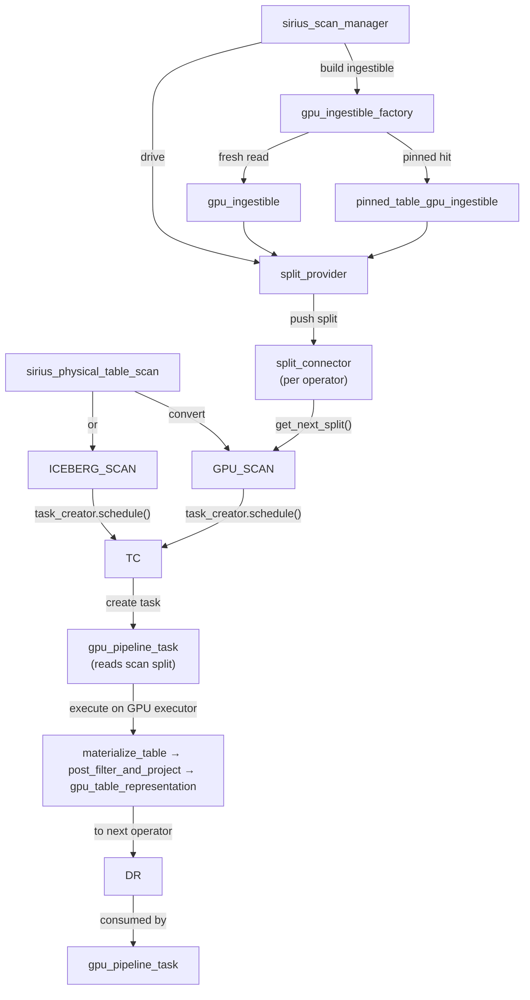

# Scan Subsystem

This document covers the scan subsystem end-to-end: how data enters Super Sirius from storage through the unified GPU scan path, the scan manager, caching, and prefetched data sources.

## Overview

Super Sirius routes table-scan input through these active paths:

| Path | Operator | Use Case | Data Flow |
|------|----------|----------|-----------|
| **Unified GPU Scan** | `GPU_SCAN` | Parquet, S3, pinned tables, and DuckDB-native file reading | `sirius_scan_manager` builds a `gpu_ingestible` and `split_provider`; the source operator materializes splits on GPU |
| **CPU Source** | `CPU_SOURCE` | Pre-computed DuckDB data such as column-data, empty-result, and dummy scans | CPU collection → pipeline source data |
| **Iceberg Scan** | `ICEBERG_SCAN` | Apache Iceberg V1/V2/V3 tables | Iceberg metadata discovery → GPU parquet ingestible + delete filters |

The production scan path is driven by `sirius_scan_manager` and a `split_provider` per scan source (see [Scan Manager](#scan-manager)).

## Scan Operators

### `sirius_physical_table_scan`
**File:** `src/include/op/sirius_physical_table_scan.hpp`

Base scan operator wrapping a DuckDB table function. During pipeline conversion, scan bind data is normalized into a source operator suitable for the current execution path.

Key members:
- `function` — DuckDB `TableFunction`
- `bind_data` — function binding info
- `column_ids` — which columns to scan
- `projection_ids` — projection optimization
- `table_filters` — predicate pushdown filters
- `scanned_types` — types of scanned columns (constructed from column IDs)

### `sirius_physical_duckdb_scan`
**File:** `src/include/op/sirius_physical_duckdb_scan.hpp`

Sequential scan using DuckDB's execution engine. Tracks an atomic `exhausted` flag. The `scanned_types` vector defines the column types for building output batches.

### `sirius_physical_parquet_scan`
**File:** `src/include/op/sirius_physical_parquet_scan.hpp`

Direct Parquet file scan. Maintains:
- `scanned_ids` — mapping of projection IDs to file column indices
- `has_more_partitions` — atomic flag for pipeline completion
- Row groups are partitioned by `approximate_batch_size` in the global state

### `sirius_physical_iceberg_scan`
**File:** `src/include/op/sirius_physical_iceberg_scan.hpp`

Iceberg table scan. Inherits from `sirius_physical_parquet_scan`. Holds delete file lists (`positional_delete_files`, `equality_delete_files`) and routes through the GPU parquet scan pipeline with a post-convert delete filter hook. See [Iceberg Scan](#iceberg-scan) below.

### `sirius_gpu_scan_operator` — `GPU_SCAN`
**File:** `src/include/op/scan/sirius_gpu_scan_operator.hpp`

Unified source operator for GPU-backed scans. The pipeline converter gives it an `ingestible_table_info` for the table format. During `prepare_for_query`, the scan manager turns that info into a concrete `gpu_ingestible`, binds a `split_connector`, and drives a `split_provider` that pushes split metadata for the operator to consume.

`execute(input_data)` runs per task: it delegates materialization and post-filter/projection to the installed `gpu_ingestible`, so the operator does not contain format-specific scan logic.

Parquet files on S3 (`s3://…` paths) are routed through the `s3_ioctx` backend automatically — the pipeline converter detects the scheme from the bind data paths and the scan manager selects the appropriate `sirius_ioctx` per GPU device at provider-construction time.

## Scan Manager

**Files:** `src/include/scan_manager/sirius_scan_manager.hpp`, `src/scan_manager/sirius_scan_manager.cpp`, `src/include/scan_manager/split_provider.hpp`, `src/include/scan_manager/split_connector.hpp`

`sirius_scan_manager` owns a configurable thread pool and is responsible for producing the input splits consumed by every `GPU_SCAN` source operator. It runs alongside the GPU pipeline executors and is independent from the data repository / port machinery used between intermediate operators.

### Components

| Component | File | Role |
|-----------|------|------|
| `sirius_scan_manager` | `scan_manager/sirius_scan_manager.{hpp,cpp}` | Owns thread pool, holds providers and pinned-table entries, drives provider execution |
| `split_provider` | `scan_manager/split_provider.hpp` | Drives a `gpu_ingestible` and pushes `operator_data` splits |
| `gpu_ingestible_factory` | `scan_manager/gpu_ingestible_factory.hpp` | Matches pinned entries or dispatches to the format-specific ingestible factory |
| `gpu_ingestible` | `io/gpu_ingestible.hpp` | Per-format split production and materialization interface |
| `split_connector` | `scan_manager/split_connector.hpp` | Lock-protected blocking queue between the provider and the operator |

### Lifecycle

1. **Plan stage:** during pipeline conversion, table-scan bind data is packaged into an `ingestible_table_info` and attached to a `sirius_gpu_scan_operator`. The operator is inserted at `operators[0]` of the pipeline; no separate metadata pipeline is created.
2. **Per-query preparation:** `sirius_scan_manager::prepare_for_query(query)` walks the plan, picks each scan source, and uses `gpu_ingestible_factory` to build the source ingestible. The factory checks for a pinned-table cache hit first and returns a `pinned_table_gpu_ingestible` on match; otherwise it dispatches to the format-specific ingestible factory. A fresh `split_connector` is bound to the operator and the provider is stored in the manager's map.
3. **Execution:** a driver thread runs providers in registration order. Each provider schedules split-production work onto the manager's thread pool. Inside the operator, `get_next_task_input_data()` blocks on `split_connector::get_next_split()` and returns each split as it arrives, so consumer-side scheduling is decoupled from production order.
4. **Teardown:** the provider closes the connector on every termination path (success, exception); on synchronous failure the manager closes it as a safety net. Once closed and drained, the operator's `all_ports_empty()` returns true and `get_next_task_hint()` returns `nullopt`.

### Parquet Split Production

`parquet_gpu_ingestible::next_split_provider()` iterates over the file list in `max_file_processed`-sized batches. Each batch:

1. Fetches parquet footers via `cudf::io::parquet::fetch_footer_to_host()`.
2. Translates the cached DuckDB filter expression into a cuDF AST on a task-local CUDA stream (filter translation is deferred from construction so each task gets its own stream).
3. Prunes row groups by min/max statistics (`filter_row_groups_with_stats`).
4. Bundles row-group slices into partitions of approximately `approximate_batch_size` uncompressed bytes. Multiple files with identical hive-partition values may be coalesced into a single partition (see [Multifile Bundling](#multifile-bundling)).
5. Pushes one `scan_operator_input` per partition into the connector. Each split carries a `parquet_split_info` with the row-group slices, reader options, pushdown state, hive partition values, and a `shared_ptr<const scan_plan>`.

### `scan_plan`

**File:** `src/include/op/scan/scan_plan.hpp`, `src/op/scan/scan_plan.cpp`

`scan_plan` is the canonical description of what a scan reads, how it assembles output, and how filters map between index spaces. It is constructed once per provider and shared (immutably) with every emitted split.

```cpp
struct scan_plan {
  std::vector<data_column>           data_columns;       // columns read from parquet, in batch order (D)
  std::vector<partition_column>      partition_columns;  // hive-injected columns (name, type, primary index)
  std::vector<output_entry>          output_layout;      // one entry per output column, in DuckDB order
  std::vector<std::optional<size_t>> batch_position_by_column_id;  // C → D map
  std::unordered_set<size_t>         partition_primary_indices;    // for filter-skip
};
```

Three index spaces appear in the parquet path:

- **P (primary index)** — DuckDB schema position
- **C (column-ids position)** — index into the scan's `column_ids` list
- **D (batch position)** — column position in the cuDF reader output (post-hive-removal)

`output_layout` is walked once in `execute()` to produce the final table: `DATA(k)` entries `std::move` from the read batch at position k, `PARTITION(k)` entries synthesize a scalar-backed column from the hive partition value. Pure-filter data columns (read but not output) fall out of scope and free.

For `SELECT *` with no partitions and no pure-filter columns, `build_inject_fn()` returns `nullptr` and the operator forwards the reader output unchanged — no permute, no copy. `SELECT count(*)` short-circuits the same way (output_layout empty) so the count aggregation sees a 0-column table without a synthesized 0-column reshape.

### Multifile Bundling

When many small parquet files each yield a small batch, scheduling and kernel-launch overhead dominates. `parquet_gpu_ingestible::run_batch()` coalesces row-group slices from **multiple files** into a single split as long as the bundled files share identical hive-partition values (so the synthesized partition columns remain scalar). `accum.total_uncompressed_bytes` accumulates across files; a split is emitted once it exceeds `approximate_batch_size` or partition values change. The downstream `cudf::io::read_parquet` call reads from all bundled files in one invocation.

### Column Mapping

Parquet column-chunk order is not guaranteed to match DuckDB's logical column order. `parquet_gpu_ingestible` builds a name-based DuckDB→parquet mapping via `parquet_schema_mapping::leaf_indices_for_column(schema, column_name)`, which walks the parquet schema's `path_in_schema` (case-insensitive, mirroring DuckDB).

For nested types (`STRUCT`, `LIST`), one DuckDB column maps to multiple parquet leaf chunks; the mapping returns all leaves under the top-level column name. The cuDF parquet reader, given a top-level column name, materializes the nested `cudf::column` natively without post-read reassembly.

## Pinned Tables

**Files:** `src/include/pin_table.hpp`, `src/pin_table.cpp`, `src/include/op/scan/pinned_table_gpu_ingestible.hpp`, `src/op/scan/pinned_table_gpu_ingestible.cpp`

The `pin_table` table function lets users pre-load a parquet table's columns into GPU memory (or, in the future, host memory) so subsequent scans of the same path bypass file I/O entirely.

```sql
CALL pin_table('/path/to/lineitem.parquet',
               name = 'lineitem',
               tier = 'gpu',
               cols = ['l_orderkey', 'l_quantity', 'l_extendedprice', 'l_shipdate']);

-- Subsequent reads of the same path are served from the pinned columns.
SELECT SUM(l_extendedprice * l_quantity)
  FROM read_parquet('/path/to/lineitem.parquet')
  WHERE l_shipdate >= DATE '1994-01-01';

CALL unpin_table('lineitem');
```

`tier` accepts `gpu` (columns pinned to GPU device memory) or `host` (columns pinned to host memory). In both cases subsequent scans of the same paths are served from the pinned columns without file I/O.

A `pinned_entry` stores the column projection, resolved file paths, per-column chunk vectors, and the memory space the columns reside in. When `prepare_for_query` runs, the scan manager matches the operator's `ingestible_table_info::file_paths()` against pinned entries; on a hit, it constructs a `pinned_table_gpu_ingestible` instead of a fresh file-reading ingestible. The pinned ingestible emits zero-copy view-backed `data_batch` inputs when possible and forwards the same `scan_plan` and filter expression as the parquet path, so the operator's `execute()` uses the same post-filter/projection surface.

`insert_pinned_entry` supports re-pinning: if an entry exists with the same row count, only new columns are merged in (duplicates dropped); a different row count drops and replaces the entry.

## GPU Ingestibles

**Files:** `src/include/io/gpu_ingestible.hpp`, `src/io/gpu_ingestible.cpp`

`gpu_ingestible` is the scan-format interface used by the unified GPU scan operator:
- `has_more_splits()` / `next_split_provider()` produce split metadata.
- `materialize_table()` reads or decodes one split into GPU-resident data.
- `post_filter_and_project()` applies scan-local filter/projection work.

Concrete ingestibles cover parquet, DuckDB-native, and pinned-table scans.

## Caching Mechanism

**File:** `src/include/op/scan/config.hpp`

Four caching levels control scan result persistence:

### `NONE` (default)
No caching. Full scan on every query. Minimal memory overhead.

### `PARQUET`
Cache raw compressed Parquet bytes in host memory. Stored as `cached_host_parquet_representation`. Decompression happens on each re-execution. Smallest memory footprint for parquet scans.

### `TABLE_HOST`
Cache decoded (decompressed) table in host memory. Stored as `cached_host_data_representation`. Avoids decompression cost on re-execution. Medium memory usage.

### `TABLE_GPU`
Cache decoded table in GPU memory. Fastest — no data movement needed for GPU execution. Highest memory cost.

## Data Representations

### `host_data_representation`
Fixed-width columnar data in host memory. Used by CPU-side and cached representations before conversion to GPU batches.

### `host_parquet_representation`
Raw Parquet bytes in host memory with deferred decompression. Contains:
- `multiple_blocks_allocation` — byte chunks
- `hybrid_scan_reader` — cuDF reader for metadata + decoding
- Byte ranges and row group indices
- File metadata (size, footer offset)

### `cached_shared_representation<T>`
**File:** `src/include/data/cached_data_representation.hpp`

Template wrapper for caching any `idata_representation` type:
- `clone(stream)` — deep copy for unique batches
- `shallow_clone()` — reference-counted copy for cache hits
- `get_representation()` — access underlying shared representation

Specializations:
- `cached_host_parquet_representation = cached_shared_representation<host_parquet_representation>`
- `cached_host_data_representation = cached_shared_representation<host_data_representation>`

## Prefetched Data Source

**File:** `src/op/scan/prefetched_data_source.cpp`, `src/include/op/scan/prefetched_data_source.hpp`

Implements `cudf::io::datasource` interface for cached Parquet data.

### `cache_ranges`
**File:** `src/op/scan/cached_ranges.cpp`

Stores sorted, non-overlapping byte ranges with packed buffers:
- Coalesces adjacent ranges to minimize lookups
- Binary search for `get_ranges(offset, size)` — returns spans covering requested bytes
- Returns `nullopt` if query crosses range boundary (not in cache)
- Supports NUMA-aware hints (`device_id`, `numa_id`) for batch copy optimization

### `host_read()`
Delegates to `cache_ranges::get_ranges()`. If cached, copies spans via memcpy. If not cached, falls back to the original datasource. Tracks `bytes_read_from_cache` vs `bytes_read_from_fallback` atomically.

### `device_read()`
Enqueues async Host→Device copies:

**CUDA 13+ path:**
```cpp
cudaMemcpyBatchAsync()  // Efficient multi-span batched copies
```
Sets `cudaMemcpyAttributes` with NUMA/device locality hints for optimal placement.

**CUDA <13 fallback:**
```cpp
// Per-span cudaMemcpyAsync()
for (auto& span : spans) {
    cudaMemcpyAsync(dst, span.data, span.size, H2D, stream);
}
```

### `device_read_async()`
Uses deferred lambda with CUDA event synchronization:
1. Records `cuda_event_guard` after async copies
2. Returns future that syncs the event on `get()`

## Sirius IO Subsystem

**Files:** `src/include/io/`, `src/io/`

`sirius::io` is a `cudf::io::datasource`-compatible I/O stack designed for high-throughput parquet reading. It is built around io_uring reactors and a pinned-memory prefetching cache, with a pluggable backend seam so additional backends (e.g. cuFile) can be added without changing the cache or the datasource layer.

### Architecture

| Component | File | Role |
|-----------|------|------|
| `sirius_datasource` | `io/sirius_datasource.{hpp,cpp}` | `cudf::io::datasource` implementation; `supports_device_read() = true`; delegates every read to the bound `sirius_ioctx` |
| `sirius_ioctx` | `io/types.hpp` | Abstract shared context owning the optional `prefetching_cache` and the reactor pool. `device_read{,_async}` consults the cache and falls through to backend I/O on miss |
| `templated_ioctx<Reactor>` | `io/templated_ioctx.hpp` | Generic ioctx implementation: request splitting, aligned 1 MiB chunking, round-robin dispatch across reactors, sync/async adapters |
| `uring_reactor` / `uring_ioctx` | `io/uring/` | Concrete io_uring backend. One thread per reactor, `O_DIRECT` device reads through pinned bounce slots, buffered host reads on the same ring |
| `prefetching_cache` | `io/prefetching_cache.{hpp,cpp}` | Pinned-memory chunk cache with lock-free per-entry state machine, background worker, evictor threads, and tiered LRU buckets |
| `buffer_pool` | `io/prefetching_cache.cpp` | Growable multi-slab pool of 1 MiB pinned chunks |
| `admission_control` | `io/admission_control.{hpp,cpp}` | RAII slot handed out against a fixed in-flight budget (default 2 GiB worth of chunks) |

### Backend Seam

Two C++20 concepts define the plug-in contract:

- `io_object_c<O, Handle>` — derives from `sirius_io_object`, exposes `host_handle()` / `device_handle()` of type `Handle`.
- `io_reactor_c<R>` — associated types (`native_handle_type`, `io_object_type`, `device_read_req_type`, `host_read_req_type`) plus operations: `enqueue_bulk`, `host_read`, `host_read_async`, `shutdown`, static `align_to_physical`.

A new backend is: a custom `io_object` + reactor + `templated_ioctx<your_reactor>`. `uring_ioctx = templated_ioctx<uring_reactor>` is the first instantiation.

### S3 Backend

**Files:** `src/include/io/s3/s3_ioctx.hpp`, `src/io/s3/s3_ioctx.cpp`, `src/include/io/s3/s3_request_authorizer.hpp`, `src/include/io/s3/s3_io_object.hpp`

`sirius::io::s3::s3_ioctx` implements the `sirius_ioctx` interface for reading parquet files from S3 using libcurl HTTP Range GETs. Unlike the io_uring backend, S3 has no native device-read path — device reads bounce through a host staging buffer followed by `cudaMemcpyAsync`.

Authentication is delegated to a `s3_request_authorizer` implementation passed via `s3_ioctx_config`:

| Authorizer | Mechanism |
|------------|-----------|
| `sirius_sigv4_presigned_authorizer` | Generates AWS SigV4-signed presigned URLs for each request |
| `sirius_sigv4_header_authorizer` | Adds `Authorization` + `x-amz-*` headers; supports STS session tokens and dual-signing modes (AWS standard + custom endpoints) |

The path from SQL to S3 reads:

```sql
SELECT * FROM read_parquet('s3://bucket/key.parquet')
```

1. Pipeline converter detects `s3://` prefix in bind data paths; stores the resolved paths in `parquet_ingestible_table_info`.
2. `sirius_scan_manager::prepare_for_query` builds a `parquet_gpu_ingestible` backed by an `s3_ioctx`.
3. The scan manager selects the per-GPU `s3_ioctx` via `gpu_ioctxs` map (injected at initialization from `SiriusContext`).
4. `parquet_gpu_ingestible` fetches parquet footers via the `s3_ioctx`, then produces scan splits served from S3 range GETs.
5. Each split's `cudf::io::read_parquet` call uses a `sirius_datasource` backed by `s3_ioctx`, routing every read through libcurl.

`s3_ioctx_config` controls authentication, connection limits, per-call timeout, retry count and backoff, and optional host-memory staging (FSMR-backed bounded staging buffer for device reads).

### Cache Seam

`sirius_ioctx::device_read{,_async}` is non-virtual: it consults `_cache` and falls through to pure-virtual `device_read_io{,_async}`. Backends never see the cache; the cache never sees the backend. `supports_device_read()` stays `true` even when the cache serves the read because the final copy is still `cudaMemcpyAsync` from pinned host memory to device.

### Cache Internals

- **Packed atomic state machine.** `entry_state` encodes a 4-bit state enum and a 28-bit pin count in a single `atomic<uint32_t>`. Every transition is one CAS, closing the TOCTOU gap between "is this entry readable?" and "bump the pin count." Readers park in `wait_while_loading()` via `atomic::wait` and are woken by `notify_all()` on completion.
- **Request aggregation via `request_context`.** One logical read fans out into N chunk sub-requests; each sub-request decrements `pending`; the last one fires the user's completion handler. Error reporting is single-writer (`failed.exchange`) so partial failures don't race.
- **Batch dispatch, amortized wakes.** `templated_ioctx::enqueue_device_read` groups chunks per-reactor with a rotating round-robin start and dispatches one `enqueue_bulk` per non-empty group, collapsing N wake-notifies to at most M (reactor count).
- **Multi-GPU safe.** `device_read_req` carries the caller's `device_id`; reactor threads `cudaSetDevice()` before issuing the H2D copy. Bounce slabs are `cudaHostAllocPortable` so they're reachable from any CUDA context.
- **Evictor as backpressure service.** When `buffer_pool.allocate_bulk` can't satisfy the worker, the worker posts an `eviction_request` (promise + chunk count) and blocks on the future. The evictor walks LRU buckets coldest-first, returns chunks to the pool, then resolves the promise. Pool exhaustion is never a silent failure.
- **Tiered LRU with age drift.** Five buckets; `refresh_cache()` is the caller's input to the aging signal. Score is `(NUM_BUCKETS-1) + n_total_request − cache_age`, clamped. Never-consumed entries get a floor of 1 to avoid being first out; raw score `< -5` is evicted on the spot during candidate drain.
- **Admission control deadlock escape.** A request larger than the total budget is granted the full budget when no other slots are outstanding, so oversized reads make progress instead of waiting forever.

### Constants (in `io/types.hpp`)

| Name | Value | Role |
|------|-------|------|
| `CHUNK_SIZE` | 1 MiB | Bounce-buffer / cache chunk size |
| `NUM_CHUNKS` | 32 | Bounce slots per reactor |
| `IO_BLOCK_SIZE` | 4096 | `O_DIRECT` alignment |
| `CHUNKS_PER_SLAB` | 500 | Pinned chunks per `buffer_pool` slab |

## Row Group Pruning

When filter pushdown is enabled and the `gpu_expression_translator` successfully converts DuckDB `TableFilterSet` filters into a cuDF AST, two optimizations activate:

1. **Row group statistics pruning:** `parquet_gpu_ingestible::run_batch()` calls `filter_row_groups_with_stats()` on each fetched footer; row groups whose Parquet column min/max statistics cannot match the filter are dropped before any read is scheduled. Pure hive-partition filters are dropped during plan construction since hive columns aren't in the parquet file.

2. **Reader-level filter pushdown:** The cuDF AST is set on `parquet_reader_options` via `set_filter()`, so cuDF applies the filter inside `read_parquet`. The `TABLE_SCAN` operator is set to passthrough (`passthrough = true`) since filtering is already done by the reader.

If AST translation fails (e.g., unsupported expression types), the GPU scan path runs the cached DuckDB filter expression through `gpu_expression_executor` on the decoded batch.

**Filter translation path:** `TableFilterSet` → `convert_table_filters_to_expression()` (skips `OPTIONAL_FILTER`, `IS_NOT_NULL`, and partition-column filters) → `gpu_expression_translator` → cuDF AST tree.

## Batch Coalescing

When many small files each produce a tiny GPU batch, per-task scheduling and kernel-launch overhead dominates. Two mechanisms address this depending on the scan path:

1. **Multifile bundling in `parquet_gpu_ingestible`** (`GPU_SCAN`): a single split may bundle row-group slices from multiple parquet files when those files share the same hive-partition values, up to `approximate_batch_size` uncompressed bytes. The downstream `cudf::io::read_parquet` call reads the bundled slices in one invocation.

2. **Post-read coalescing in `sirius_physical_table_scan`** (DUCKDB_SCAN): `get_next_task_input_data()` pops batches in a loop until `accumulated_bytes >= scan_task_batch_size` OR `batch_count >= 32`, returning a `pipelineable_operator_data` wrapping the accumulated batches. `execute()` then calls `cudf::concatenate()` before filtering/projecting.

When the GPU parquet scan applies filter+projection via the cuDF reader (passthrough mode), `TABLE_SCAN` skips concatenation — only the DuckDB-source code path goes through post-read coalescing.

## Iceberg Scan

**Files:** `src/include/op/sirius_physical_iceberg_scan.hpp`, `src/op/scan/iceberg_metadata_reader.cpp`, `src/op/scan/iceberg_delete_pipeline.cpp`

`sirius_physical_iceberg_scan` inherits from `sirius_physical_parquet_scan` and adds support for Iceberg V1, V2, and V3 tables.

### Supported Iceberg Features

| Version | Feature | Implementation |
|---------|---------|---------------|
| V1 | Append-only (no deletes) | Identical to plain parquet scan |
| V2 | Positional deletes | `positional_delete_filter`: binary-searches sorted row positions, builds boolean mask, applies `cudf::apply_boolean_mask` |
| V2 | Equality deletes (heterogeneous) | A `vector<EqualityDeleteGroup>` carries one `cudf::distinct_hash_join` per distinct key schema; each group is sequence-scoped so it only applies to data files written before its sequence number |
| V3 | Deletion vectors | Read from PUFFIN files via `puffin_reader`; the resulting bitmap drives the same boolean-mask filter as positional deletes |
| V2/V3 | Schema evolution | Per-file projection detects which columns are present in each parquet file; missing columns are injected as typed NULL columns post-read |
| V2/V3 | Snapshot time-travel | `snapshot_from_id` is forwarded to DuckDB's `iceberg_metadata()` so the manifest matches the requested snapshot |
| V2/V3 | Partition evolution | Per-file inject function decides whether each column comes from parquet data, from the file path (hive-style), or is NULL — handles tables whose partition scheme changed across snapshots |

### Architecture

- Iceberg manifest discovery delegates to DuckDB's `iceberg_metadata()`; the custom Avro reader in `iceberg_avro_reader.cpp` is the fallback for V3 deletion-vector PUFFIN files. Delete handling is composed through `iceberg_delete_pipeline`.
- The `post_convert_fn_t` hook fires after each row-group batch is decompressed to a `cudf::table`, applying all delete filters in-place with zero `cudaMemcpy D2H` in the hot path.
- Equality-delete key columns not in the user's projection are force-projected at read time, then stripped via zero-copy `release()` + truncate after all filters run, so downstream operators see only the requested columns.
- Equality deletes apply only to data files whose sequence number is less than the delete group's, mirroring Iceberg's snapshot semantics.

## Complete Scan Flow



## Key Files

| File | Purpose |
|------|---------|
| `src/include/op/scan/sirius_gpu_scan_operator.hpp` | Unified GPU scan source operator |
| `src/op/scan/sirius_gpu_scan_operator.cpp` | GPU scan source execution |
| `src/include/op/scan/sirius_gpu_scan_operator_data.hpp` | Scan split operator-data types |
| `src/include/io/gpu_ingestible.hpp` | Per-format scan ingestible interface |
| `src/io/gpu_ingestible.cpp` | Ingestible factory dispatch |
| `src/include/op/scan/parquet_gpu_ingestible.hpp` | Parquet ingestible interface |
| `src/op/scan/parquet_gpu_ingestible.cpp` | Parquet metadata and split materialization |
| `src/include/op/scan/duckdb_native_gpu_ingestible.hpp` | DuckDB-native ingestible interface |
| `src/op/scan/duckdb_native_gpu_ingestible.cpp` | DuckDB-native split materialization |
| `src/include/op/scan/pinned_table_gpu_ingestible.hpp` | Pinned-table ingestible interface |
| `src/op/scan/pinned_table_gpu_ingestible.cpp` | Pinned-table split materialization |
| `src/op/scan/prefetched_data_source.cpp` | Cached datasource for cuDF |
| `src/include/op/scan/prefetched_data_source.hpp` | Cached datasource interface |
| `src/op/scan/cached_ranges.cpp` | Byte range coalescing and lookup |
| `src/include/op/scan/cached_ranges.hpp` | Cache range structure |
| `src/include/op/scan/config.hpp` | Scan config, cache_level enum |
| `src/include/op/scan/duckdb_native_metadata.hpp` | DuckDB row-group segment metadata walker |
| `src/include/op/scan/duckdb_native_decoder.hpp` | DuckDB format GPU decode kernels |
| `src/include/op/scan/scan_plan.hpp` | Index-space mapping (P/C/D), output layout, partition injection |
| `src/include/op/scan/parquet_schema_mapping.hpp` | Name-based DuckDB→parquet column resolution |
| `src/include/scan_manager/sirius_scan_manager.hpp` | Scan manager: thread pool, providers, pinned-table registry |
| `src/include/scan_manager/gpu_ingestible_factory.hpp` | Ingestible selection and pinned-table matching |
| `src/include/scan_manager/split_provider.hpp` | Abstract split producer |
| `src/include/scan_manager/split_connector.hpp` | Blocking queue between provider and operator |
| `src/include/io/s3/s3_ioctx.hpp` | S3 ioctx: libcurl HTTP Range GET backend |
| `src/include/io/s3/s3_request_authorizer.hpp` | Authentication abstraction (SigV4 presigned / header-signing) |
| `src/include/io/s3/s3_io_object.hpp` | S3 io_object with bucket/key/size metadata |
| `src/include/pin_table.hpp` / `src/pin_table.cpp` | `pin_table` / `unpin_table` table-function bindings |
| `src/include/op/sirius_physical_iceberg_scan.hpp` | Iceberg scan operator |
| `src/include/op/scan/iceberg_metadata_reader.hpp` | Iceberg manifest reader (DuckDB `iceberg_metadata()` + Avro fallback) |
| `src/include/op/scan/puffin_reader.hpp` | V3 deletion-vector PUFFIN reader |
| `src/op/scan/scan_utils.cpp` | Row group pruning, filter expression conversion |
| `src/include/data/cached_data_representation.hpp` | Cached data wrappers |
